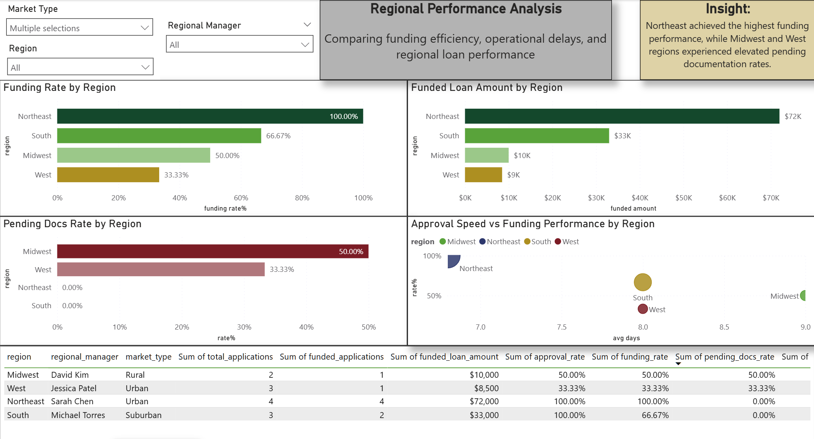
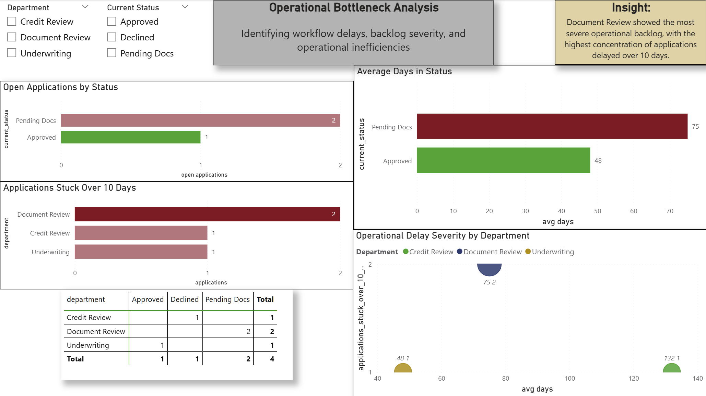
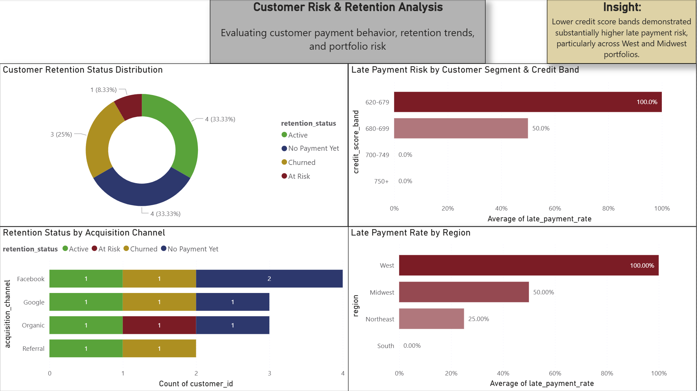

# Financial Operations Performance Analysis

End-to-end SQL and Power BI analytics project simulating operational, regional, and customer performance analysis within a financial services environment.

This project demonstrates:
- SQL data cleaning and transformation workflows
- KPI development and operational analysis
- Regional performance benchmarking
- Customer retention and payment risk analysis
- Interactive Power BI dashboard development
- Business insight generation for executive decision-making

---

# Tools Used

- PostgreSQL
- Power BI
- SQL
- Data Modeling
- KPI Analysis
- Window Functions
- CTEs
- Business Intelligence Reporting

---

# Project Objectives

The goal of this project was to simulate a real-world financial operations analyst workflow by:

- Cleaning and validating raw operational data
- Building analytical SQL views for reporting
- Identifying operational bottlenecks
- Measuring regional loan performance
- Evaluating customer payment risk and retention trends
- Delivering executive-level dashboard reporting

---

# SQL Workflow

The SQL portion of the project was separated into modular analysis stages:

| File | Purpose |
|------|---------|
| 01_create_raw_tables.sql | Create raw operational tables |
| 02_insert_sample_data.sql | Insert sample financial operations data |
| 03_data_quality_checks.sql | Validate data quality and identify issues |
| 04_clean_views.sql | Create cleaned analytical views |
| 05_monthly_loan_kpis.sql | Monthly loan KPI analysis |
| 06_regional_performance.sql | Regional funding and approval analysis |
| 07_operational_bottlenecks.sql | Workflow delay and backlog analysis |
| 08_payment_quality_kpis.sql | Payment quality and delinquency metrics |
| 09_customer_retention_risk.sql | Customer retention and risk segmentation |

---

# Dashboard Preview

## Executive Loan Performance Overview

Tracks:
- funding volume trends
- approval and funding rates
- month-over-month KPI performance

---

## Regional Performance Analysis

Analyzes:
- regional funding efficiency
- approval performance
- operational delays
- management benchmarking

---

## Operational Bottleneck Analysis

Identifies:
- workflow delays
- backlog severity
- operational inefficiencies

---

## Customer Risk & Retention Analysis

Evaluates:
- payment delinquency risk
- retention behavior
- acquisition channel performance
- customer segmentation

---

# Key Business Insights

- Northeast region achieved the strongest funding performance.
- Midwest and West regions demonstrated elevated pending documentation rates.
- Document Review displayed the highest operational backlog severity.
- Lower credit score bands demonstrated substantially higher late-payment risk.
- Customer acquisition channels showed varying retention and delinquency behavior.

---

# Future Improvements

Potential future enhancements include:
- automated ETL workflows
- larger transactional datasets
- predictive risk modeling
- advanced DAX calculations
- drill-through dashboard navigation
- time-series forecasting

---

# Author

Tyler Edmeade

Data Analytics | SQL | Power BI | Financial & Operational Analytics
