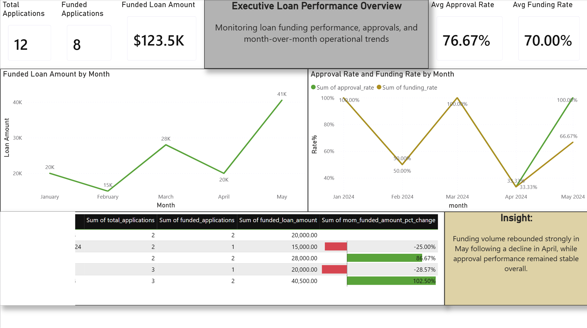

# Financial Operations Performance Analysis (SQL + Power BI)

This project simulates an operational lending environment where SQL and Power BI are used to monitor loan performance, identify operational bottlenecks, evaluate regional efficiency, and assess customer payment risk.

Rather than focusing only on dashboard creation, this project connects executive KPIs to the operational processes that drive them, including approval efficiency, documentation delays, regional performance, and customer repayment behavior.

## Dashboard Preview



## Business Questions

- How is overall loan funding performance changing over time?
- Which regions operate most efficiently throughout the lending process?
- Where do operational bottlenecks delay application processing?
- Which customer segments demonstrate elevated payment risk?
- What operational improvements could increase funding performance?

## Project Workflow

- Created raw operational tables for customers, loan applications, payments, regions, and support cases.
- Validated data quality issues such as duplicates, orphan records, missing values, and inconsistent statuses.
- Built cleaned SQL views for reporting and analysis.
- Developed KPI views for funding performance, regional efficiency, bottlenecks, payment quality, and customer risk.
- Designed Power BI dashboards to summarize business performance and support recommendations.

## Tools Used

- PostgreSQL
- SQL
- Power BI
- DAX
- Data Modeling
- KPI Development
- Business Intelligence Reporting

## Repository Structure

```text
sql/
insights/
powerbi/dashboard_screenshots/
README.md
